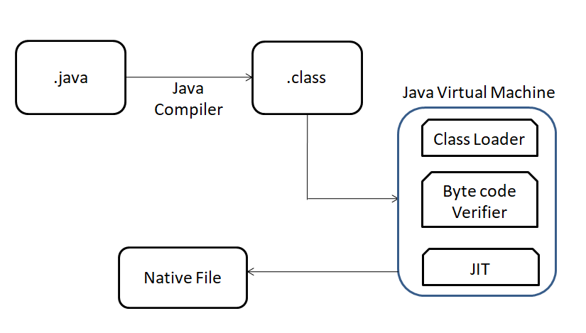
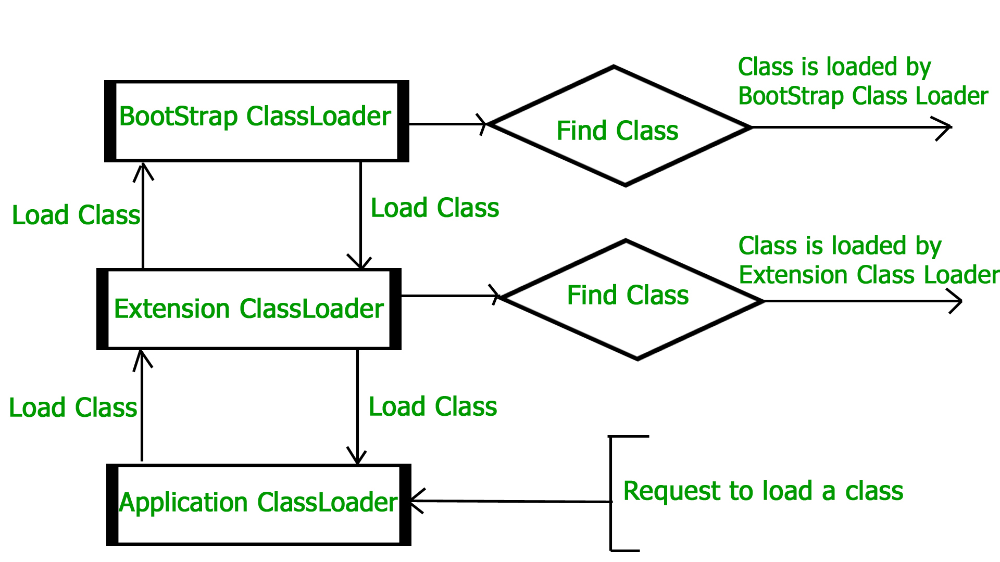
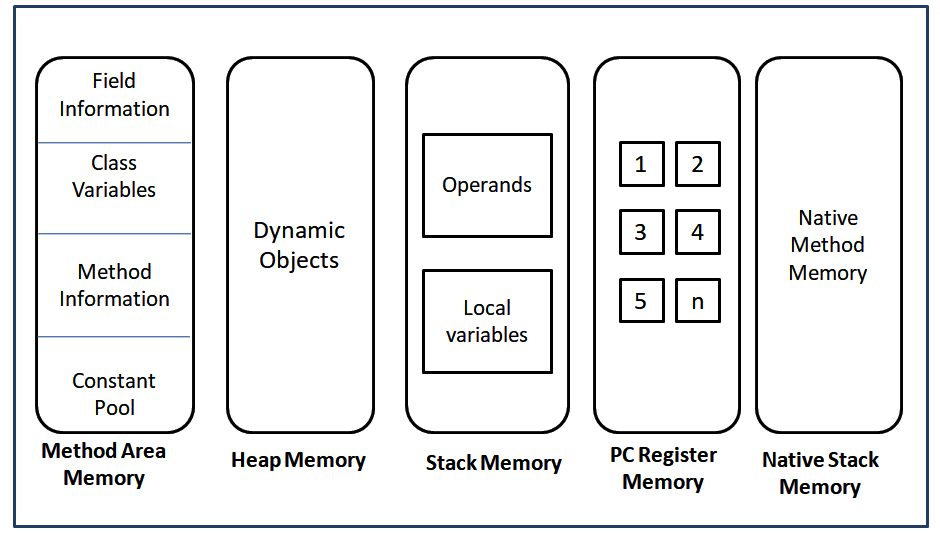

# Chapter 001

### Table of Contents:

1. [JXX](#jxx)
2. [Create Project](#create-project)
3. [Test](#test)
4. [Other Concepts](#other-concepts)

## JXX

Positions:
- Java full stack developer (_UI testing, ..._)
- Java Web developer (_JSP, Servlet, ..._)
- Java mobile app developer (_Android, ..._)
- Java EE developer (_EJB, Spring, Hibernate, REST, ..._)
- Java API developer (_Spring Boot, ..._)

#### Java program execution flow

#### Key files in Java program
- .java
- .class
- OS executable file

#### JRE (_Java Runtime Environment_)

- Definition:
  - JRE is typically a program that can communicate with the class file provided to it.
  - A runtime environment is typically a kind of physical operating system on which the software runs traditionally.
  - JRE accepts your code, merges the different dependencies via a Java class loader, and passes it to JVM
  - implementation of JVM
  - The main job of JRE is to provide a runtime environment to Java
  

- Components:

  1. Class loader 
  
       - searching and loading classes in memory 
       - classes are not loaded at once in memory by the class loader; it is done on a demand basis
       
       - Types (where they load the classes dynamically?):
 
         - Bootstrap class loader
           - loads jre/lib/**rt.jar** file which is a repository of all the system or internal classes in Java
           - in the lib directory of JRE
           - primordial class loader
           - implemented by C or C++ libraries
        
         - Extension class loader
           - child of the bootstrap class loader
           - in the **jre/lib/ext** directory
           - system property **java.ext.dirs**
    
         - System class loader (application)
           - child of the extension class loader
           - developer sets up the class path
           - loads the classes from the class path
           - CLASSPATH
    
       - Principles of functionality of a Java ClassLoader 
         - Delegation Hierarchy Algorithm ([*reference](https://www.geeksforgeeks.org/classloader-in-java/))
            

                
            

         - Visibility Principle
         - Uniqueness Property
       
       - Custom Class Loaders ([*reference](https://www.baeldung.com/java-classloaders))
         - Use-Cases
           - modify the existing bytecode -> **e.g. weaving agents**
           - dynamic class loading -> **e.g. in JDBC, switching between different driver**
           - implementing a class versioning mechanism -> **URL class loader (load jars via URLs)**
         - CustomClassLoader -> [Code](JdbcCustomDriverLoader.java)
  
     
  2. Bytecode verifier

     - JVM has a gatekeeper
     
     - verifications:
       - The operand stack present in the frame should not get overflowed, and it should not be underflow or underutilized. 
       - The variables must be initialized before the usage.
       - Private data from the class is not accessed from outside of the class. 
       - The proper references must be used for the method calls. 
       - The stack should not get overflowed.
       - The final classes are not extended, and the final methods are not overridden.
       - If the verifier finds that something is missing from the preceding list, the code execution is blocked for that file.
     
     - bytecode verifier along with compiler?
     
     

  3. Interpreter

#### JVM 

- _the heart of the entire Java ecosystem_
- a runtime environment provided by Java
- The main task of JVM is to execute the bytecode, which is the platform-independent file format
- platform-dependant

- Architecture
    

        
    

    [*reference](https://www.javatpoint.com/java-architecture)

- Memory management in JVM
    
  

    
  

  
  - all these segments get stored temporarily as long as the program is executing
  - do not get stored at the **same location** in JVM
  - get stored in to **different logical** compartments

- types of memory areas:
  - Method Area or Class
    - class information like variables, method data, or runtime constant pool
  - Heap
    - fixed size memory
    - store the object or arrays
  - Stack
    - stores the frames created during execution for each thread
    - expandable at runtime
    - local variable and references to object or arrays
  - PC
    - Every task that is being executed by JVM is executed within a thread
  - Native Stack
    - utilized by the native method if used in an application

- Exception
  - OutOfMemoryException?
    - heap memory size
    - java Sample -Xms512m -Xmx1024m
    - _JAVA_OPTIONS = -Xms512m -Xmx1024m
  - java.lang.StackOverflowError
    - recursive calls

#### Just-in-time compiler

- JIT 
  - converts the bytecode to native code
  - performance
  - contrast to normal compilers
  - dynamic in nature
  - JIT and JVM are integrated together
  - JIT comes bundled with JVM (not possible to separate)

- JIT vs AoT([Ahead-of-Time Compilation](https://openjdk.org/jeps/295))

- Interpreter Story:
  - jdk 1.0 -> C, infinite while loop
  - jdk 1.2 -> C++, Hotspot VM 
  - zero-assembler
  - template interpreter -> codelet, dispatch table

Hotspot
- one implementation of JIT technology that starts by running interpreted, and watches the actual performance of the app
- an implementation of the part of the JVM concept, originally developed by Sun, and now it is owned by Oracle

[List of Java Virtual Machine Implementations](https://en.wikipedia.org/wiki/List_of_Java_virtual_machines)
- OpenJ9
  - is an alternative
- ...

[Java SE > Java SE Specifications](https://docs.oracle.com/javase/specs/index.html)
- The Java Language Specification
- The Java Virtual Machine Specification

#### JDK

Java Development Kit

this is a developer’s bundle

#### OpenJDK, Oracle OpenJDK, ...

is an open-source project that fully implements 

- the Java Specifications, 
- JSRs, -> Java Specification Requests
- and JEPs -> JDK Enhancement Proposals

that define the Java platform

## Create Project

## Test

## Other Concepts

 