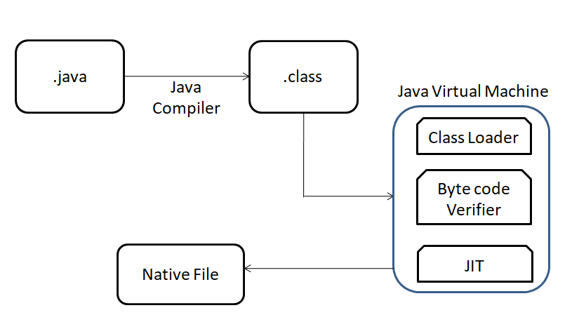

# Chapter 001

### Table of Contents:

1. [JXX](#jxx)
2. [Create Project](#create-project)
3. [Test](#test)
4. [Other Concepts](#other-concepts)

## JXX

Positions:
- Java full stack developer (_UI testing, ..._)
- Java Web developer (_JSP, Servlet, ..._)
- Java mobile app developer (_Android, ..._)
- Java EE developer (_EJB, Spring, Hibernate, REST, ..._)
- Java API developer (_Spring Boot, ..._)

#### Java program execution flow

#### Key files in Java program
- .java
- .class
- OS executable file

#### JVM

#### JRE (_Java Runtime Environment_)

- Definition:
  - JRE is typically a program that can communicate with the class file provided to it.
  A runtime environment is typically a kind of physical operating system on which the software runs traditionally.
  JRE accepts your code, merges the different dependencies via a Java class loader, and passes it to JVM
  

- Components:

  1. Class loader 
  
       - searching and loading classes in memory 
       - classes are not loaded at once in memory by the class loader; it is done on a demand basis
       
       - Types (where they load the classes dynamically?):
 
         - Bootstrap class loader
           - loads jre/lib/**rt.jar** file which is a repository of all the system or internal classes in Java
           - in the lib directory of JRE
           - primordial class loader
           - implemented by C or C++ libraries
        
         - Extension class loader
           - child of the bootstrap class loader
           - in the **jre/lib/ext** directory
           - system property **java.ext.dirs**
    
         - System class loader (application)
           - child of the extension class loader
           - developer sets up the class path
           - loads the classes from the class path
           - CLASSPATH
    
       - Principles of functionality of a Java ClassLoader 
         - Delegation Hierarchy Algorithm ([*reference](https://www.geeksforgeeks.org/classloader-in-java/))
           
         - Visibility Principle
         - Uniqueness Property
       
       - Custom Class Loaders ([*reference](https://www.baeldung.com/java-classloaders))
         - Use-Cases
           - modify the existing bytecode -> **e.g. weaving agents**
           - dynamic class loading -> **e.g. in JDBC, switching between different driver**
           - implementing a class versioning mechanism -> **URL class loader (load jars via URLs)**
         - CustomClassLoader -> [Code](JdbcCustomDriverLoader.java)
       
  2. Bytecode verifier 
  3. Interpreter

#### JDK

#### Bytecode verifier

#### Just-in-time compiler

#### OpenJDK, Oracle OpenJDK, ...

## Create Project

## Test

## Other Concepts

 